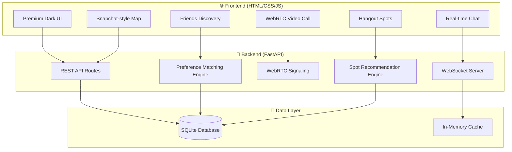

# Hangout — Like-Minded People Social Platform

A Python-based social application where users can discover like-minded people, chat, video call, find nearby hangout spots based on shared interests, and see friends on a live map.

## User Review Required

> [!IMPORTANT]
> **API Keys Needed**: This app uses **Google Places API** for spot recommendations and **Leaflet/OpenStreetMap** for the map (free, no key needed). For Places API, you'll need a Google Cloud API key. Should I use mock/demo data instead so you can test without API keys?

> [!IMPORTANT]
> **Video Calling**: WebRTC peer-to-peer video calling requires a STUN/TURN server for production. For development, we'll use free public STUN servers (`stun:stun.l.google.com:19302`). This works fine on local networks.

> [!WARNING]
> **Authentication**: For the initial version, I'll implement a simple username/password auth with JWT tokens (no OAuth/social login). Want me to add Google/social login later?

## Open Questions

1. **Preference Categories** — I'm planning these interest categories: `Food & Dining`, `Gaming`, `Sports & Fitness`, `Movies & Entertainment`, `Music`, `Travel & Adventure`, `Art & Culture`, `Tech & Coding`, `Reading & Books`, `Nightlife`. Should I add/remove any?
2. **Deployment** — Are you planning to deploy this, or is it for local demo/portfolio purposes? This affects whether I set up production configs.
3. **Mobile vs Web** — I'll build a responsive web app first. Do you want a React Native mobile version later?

---

## Architecture Overview



## Tech Stack

| Layer | Technology | Why |
|-------|-----------|-----|
| **Backend** | Python 3.11+ / FastAPI | Async support, WebSocket, fast API development |
| **Database** | SQLite + SQLAlchemy | Zero setup, good for dev, easy to migrate to PostgreSQL |
| **Auth** | JWT (PyJWT) | Stateless authentication |
| **Real-time Chat** | WebSocket (FastAPI native) | Low-latency bidirectional messaging |
| **Video Calling** | WebRTC + FastAPI signaling | Peer-to-peer, no media server needed |
| **Frontend** | Vite + React (JavaScript) | Component-based, fast HMR, modern DX |
| **Styling** | Vanilla CSS (design system) | Full control, premium dark-mode UI |
| **Maps** | Leaflet.js + react-leaflet | Free, no API key, React integration |
| **Spot Recommendations** | Overpass API (OpenStreetMap) | Free, no API key, real-world POI data |
| **Password Hashing** | bcrypt (passlib) | Industry standard |

---

## Proposed Changes

### Project Structure

```
hangout/
├── backend/
│   ├── main.py              # FastAPI app entry point
│   ├── config.py             # Configuration & settings
│   ├── database.py           # SQLAlchemy setup & models
│   ├── models.py             # Pydantic schemas
│   ├── auth.py               # JWT authentication
│   ├── routes/
│   │   ├── __init__.py
│   │   ├── users.py          # User registration, profile, preferences
│   │   ├── friends.py        # Friend discovery, requests, management
│   │   ├── chat.py           # Chat WebSocket & message history
│   │   ├── video.py          # WebRTC signaling server
│   │   ├── spots.py          # Hangout spot recommendations
│   │   └── location.py       # Location sharing for map
│   ├── services/
│   │   ├── __init__.py
│   │   ├── matching.py       # Preference matching algorithm
│   │   └── recommendations.py # Spot recommendation engine
│   └── seed_data.py          # Demo data seeder
├── frontend/                  # Vite + React (JavaScript)
│   ├── index.html            # Vite entry HTML
│   ├── vite.config.js        # Vite config with API proxy
│   ├── package.json
│   ├── src/
│   │   ├── main.jsx          # React entry point
│   │   ├── App.jsx           # Root component with router
│   │   ├── index.css         # Global design system
│   │   ├── api/
│   │   │   └── client.js     # Axios/fetch wrapper with JWT
│   │   ├── context/
│   │   │   ├── AuthContext.jsx    # Auth state provider
│   │   │   └── SocketContext.jsx  # WebSocket provider
│   │   ├── pages/
│   │   │   ├── Login.jsx          # Login / Register page
│   │   │   ├── Home.jsx           # Dashboard / Feed
│   │   │   ├── Friends.jsx        # Discover + My Friends + Requests
│   │   │   ├── Chat.jsx           # Conversations + messaging
│   │   │   ├── VideoCall.jsx      # WebRTC video calling
│   │   │   ├── Map.jsx            # Snapchat-style friend map
│   │   │   ├── Spots.jsx          # Hangout recommendations
│   │   │   └── Profile.jsx        # Profile & preferences
│   │   └── components/
│   │       ├── Sidebar.jsx        # Navigation sidebar
│   │       ├── UserCard.jsx       # Reusable user display card
│   │       ├── ChatBubble.jsx     # Message bubble component
│   │       ├── PreferenceChip.jsx # Interest tag chip
│   │       ├── SpotCard.jsx       # Hangout spot card
│   │       ├── FriendMarker.jsx   # Custom map marker
│   │       ├── IncomingCall.jsx   # Call notification modal
│   │       └── ProtectedRoute.jsx # Auth route guard
│   └── public/
│       └── (static assets)
├── requirements.txt
├── run.py                    # Single-command startup (backend + frontend)
└── README.md
```

---

### Backend Components

#### [NEW] [main.py](file:///c:/Users/balar/OneDrive/Desktop/hangout/backend/main.py)
- FastAPI application with CORS middleware (allows Vite dev server origin)
- Include all route modules
- WebSocket endpoints for chat and video signaling
- Startup/shutdown lifecycle events

#### [NEW] [config.py](file:///c:/Users/balar/OneDrive/Desktop/hangout/backend/config.py)
- JWT secret key, algorithm, token expiry
- Database URL configuration
- CORS allowed origins

#### [NEW] [database.py](file:///c:/Users/balar/OneDrive/Desktop/hangout/backend/database.py)
- SQLAlchemy engine and session setup
- Database models:
  - **User**: id, username, email, password_hash, bio, avatar_url, latitude, longitude, last_seen, created_at
  - **UserPreference**: user_id, category, subcategories (JSON), weight
  - **Friendship**: user_id, friend_id, status (pending/accepted/blocked), created_at
  - **Message**: id, sender_id, receiver_id, content, message_type, timestamp, read
  - **HangoutSpot**: id, name, category, lat, lng, rating, description, address (cached from API)

#### [NEW] [models.py](file:///c:/Users/balar/OneDrive/Desktop/hangout/backend/models.py)
- Pydantic request/response schemas for all endpoints

#### [NEW] [auth.py](file:///c:/Users/balar/OneDrive/Desktop/hangout/backend/auth.py)
- JWT token creation and verification
- Password hashing with bcrypt
- Auth dependency for protected routes

#### [NEW] [routes/users.py](file:///c:/Users/balar/OneDrive/Desktop/hangout/backend/routes/users.py)
- `POST /api/auth/register` — Create account with preferences
- `POST /api/auth/login` — Login, return JWT
- `GET /api/users/me` — Get current user profile
- `PUT /api/users/me` — Update profile & preferences
- `PUT /api/users/me/location` — Update current location

#### [NEW] [routes/friends.py](file:///c:/Users/balar/OneDrive/Desktop/hangout/backend/routes/friends.py)
- `GET /api/friends` — List accepted friends
- `GET /api/friends/discover` — Find like-minded users (matching engine)
- `POST /api/friends/request/{user_id}` — Send friend request
- `PUT /api/friends/request/{request_id}` — Accept/reject request
- `GET /api/friends/requests` — View pending requests

#### [NEW] [routes/chat.py](file:///c:/Users/balar/OneDrive/Desktop/hangout/backend/routes/chat.py)
- `WebSocket /ws/chat/{user_id}` — Real-time messaging
- `GET /api/chat/history/{friend_id}` — Message history with pagination
- `GET /api/chat/conversations` — List all conversations with last message

#### [NEW] [routes/video.py](file:///c:/Users/balar/OneDrive/Desktop/hangout/backend/routes/video.py)
- `WebSocket /ws/video/{user_id}` — WebRTC signaling (offer/answer/ICE candidates)
- Handles call initiation, acceptance, rejection, and hangup

#### [NEW] [routes/spots.py](file:///c:/Users/balar/OneDrive/Desktop/hangout/backend/routes/spots.py)
- `GET /api/spots/recommend` — Get personalized spot recommendations based on user preferences and location
- `GET /api/spots/nearby` — Get nearby spots by category
- `GET /api/spots/{spot_id}` — Spot details

#### [NEW] [routes/location.py](file:///c:/Users/balar/OneDrive/Desktop/hangout/backend/routes/location.py)
- `PUT /api/location/update` — Update user's real-time location
- `GET /api/location/friends` — Get all friends' locations for the map

#### [NEW] [services/matching.py](file:///c:/Users/balar/OneDrive/Desktop/hangout/backend/services/matching.py)
- **Preference matching algorithm**:
  - Cosine similarity between user preference vectors
  - Weighted scoring based on category importance
  - Geographic proximity bonus
  - Returns ranked list of compatible users with match percentage

#### [NEW] [services/recommendations.py](file:///c:/Users/balar/OneDrive/Desktop/hangout/backend/services/recommendations.py)
- Maps user preference categories to place types:
  - `Food & Dining` → restaurants, cafes, bakeries
  - `Gaming` → arcades, gaming cafes, entertainment centers
  - `Sports & Fitness` → gyms, sports complexes, parks
  - `Movies & Entertainment` → cinemas, theaters
  - etc.
- Uses **Overpass API** (free OpenStreetMap data) to find nearby places
- Falls back to curated demo data if API unavailable
- Scores and ranks spots based on preference weight + rating + distance

#### [NEW] [seed_data.py](file:///c:/Users/balar/OneDrive/Desktop/hangout/backend/seed_data.py)
- Creates 10-15 demo users with diverse preferences
- Pre-populates friendships and sample messages
- Adds sample hangout spots

---

### Frontend (Vite + React JS)

#### [NEW] [vite.config.js](file:///c:/Users/balar/OneDrive/Desktop/hangout/frontend/vite.config.js)
- React plugin
- Dev server proxy → `localhost:8000` for API & WebSocket calls
- Build output configured for FastAPI static serving

#### [NEW] [index.css](file:///c:/Users/balar/OneDrive/Desktop/hangout/frontend/src/index.css)
Premium dark-mode design system featuring:
- **Color palette**: Deep navy/charcoal backgrounds, vibrant accent gradients (purple → cyan → pink)
- **Glassmorphism**: Frosted glass cards and panels with `backdrop-filter`
- **Typography**: Inter font from Google Fonts
- **Animations**: Smooth page transitions, hover effects, pulse indicators for online status
- **Component styles**: Cards, buttons, inputs, badges, avatars, chat bubbles, notification dots
- **Responsive**: Mobile-first with breakpoints for tablet/desktop
- **Map styles**: Custom Leaflet overrides to match dark theme

#### [NEW] [App.jsx](file:///c:/Users/balar/OneDrive/Desktop/hangout/frontend/src/App.jsx)
- React Router setup with routes for all pages
- AuthContext & SocketContext providers wrapping the app
- Protected route guards
- Sidebar navigation layout

#### [NEW] [client.js](file:///c:/Users/balar/OneDrive/Desktop/hangout/frontend/src/api/client.js)
- Fetch wrapper with automatic JWT auth headers
- Base URL configuration
- Error handling, token refresh, logout on 401

#### [NEW] [AuthContext.jsx](file:///c:/Users/balar/OneDrive/Desktop/hangout/frontend/src/context/AuthContext.jsx)
- Auth state management (user, token, preferences)
- Login/register/logout actions
- Token persistence in localStorage
- Auto-login on app load

#### [NEW] [SocketContext.jsx](file:///c:/Users/balar/OneDrive/Desktop/hangout/frontend/src/context/SocketContext.jsx)
- WebSocket connection lifecycle (connect/disconnect)
- Chat message event handling
- Video call signaling event handling
- Online presence tracking

#### [NEW] [Login.jsx](file:///c:/Users/balar/OneDrive/Desktop/hangout/frontend/src/pages/Login.jsx)
- Login/Register forms with animated transitions
- Preference selection UI (multi-select chips with categories & subcategories)
- Smooth onboarding flow

#### [NEW] [Home.jsx](file:///c:/Users/balar/OneDrive/Desktop/hangout/frontend/src/pages/Home.jsx)
- Dashboard with activity feed
- Quick stats (friends count, nearby spots, match suggestions)
- Featured hangout spots
- "People you may know" widget

#### [NEW] [Friends.jsx](file:///c:/Users/balar/OneDrive/Desktop/hangout/frontend/src/pages/Friends.jsx)
- **Discover tab**: Like-minded users with match % and shared interest badges
- **My Friends tab**: Current friends list with online status
- **Requests tab**: Pending friend requests with accept/reject
- UserCard components with quick chat / video call buttons

#### [NEW] [Chat.jsx](file:///c:/Users/balar/OneDrive/Desktop/hangout/frontend/src/pages/Chat.jsx)
- Conversation list sidebar with last message preview
- Real-time messaging with ChatBubble components
- Typing indicators, timestamps, read receipts
- Emoji support, online status indicators

#### [NEW] [VideoCall.jsx](file:///c:/Users/balar/OneDrive/Desktop/hangout/frontend/src/pages/VideoCall.jsx)
- WebRTC peer connection setup
- Camera/microphone access with `getUserMedia`
- Local + remote video streams
- Call controls (mute, camera toggle, screen share, hang up)
- IncomingCall modal component

#### [NEW] [Map.jsx](file:///c:/Users/balar/OneDrive/Desktop/hangout/frontend/src/pages/Map.jsx)
- `react-leaflet` map with dark theme tiles (CartoDB Dark Matter)
- Custom FriendMarker components (avatar circles, Snapchat-style)
- Real-time friend location polling
- Click marker → mini profile popup with chat/call actions
- Current user location tracking via Geolocation API
- Hangout spot pins with category-colored icons

#### [NEW] [Spots.jsx](file:///c:/Users/balar/OneDrive/Desktop/hangout/frontend/src/pages/Spots.jsx)
- Personalized SpotCard recommendation grid
- Category filter tabs (Restaurants, Gaming, Sports, Movies, etc.)
- Distance, rating, and preference-match display
- "Get Directions" link to Google Maps
- Spot detail modal

#### [NEW] [Profile.jsx](file:///c:/Users/balar/OneDrive/Desktop/hangout/frontend/src/pages/Profile.jsx)
- Profile editing form (name, bio, avatar)
- Preference management with PreferenceChip components
- Location sharing toggle
- Account settings

#### [NEW] Reusable Components
- **Sidebar.jsx** — Navigation with icons, active states, notification badges
- **UserCard.jsx** — Avatar, name, match %, shared interests, action buttons
- **ChatBubble.jsx** — Sent/received message styling with timestamps
- **PreferenceChip.jsx** — Colored interest tags (selectable/removable)
- **SpotCard.jsx** — Glassmorphic card with spot info, rating, distance
- **FriendMarker.jsx** — Custom Leaflet marker with avatar
- **IncomingCall.jsx** — Full-screen call notification overlay
- **ProtectedRoute.jsx** — Redirects unauthenticated users to login

---

### Root Files

#### [NEW] [requirements.txt](file:///c:/Users/balar/OneDrive/Desktop/hangout/requirements.txt)
```
fastapi==0.115.0
uvicorn[standard]==0.30.0
sqlalchemy==2.0.35
pydantic==2.9.0
python-jose[cryptography]==3.3.0
passlib[bcrypt]==1.7.4
python-multipart==0.0.9
httpx==0.27.0
aiofiles==24.1.0
```

#### [NEW] [package.json](file:///c:/Users/balar/OneDrive/Desktop/hangout/frontend/package.json)
```
react, react-dom, react-router-dom
react-leaflet, leaflet
@vitejs/plugin-react
```

#### [NEW] [run.py](file:///c:/Users/balar/OneDrive/Desktop/hangout/run.py)
- Single command: `python run.py`
- Installs frontend dependencies (`npm install`) if needed
- Starts Vite dev server (port 5173) + FastAPI backend (port 8000) concurrently
- Creates database tables and seeds demo data on first run
- Opens browser automatically

#### [NEW] [README.md](file:///c:/Users/balar/OneDrive/Desktop/hangout/README.md)
- Project description, features, setup instructions, screenshots

---

## Key Feature Details

### 🤝 Preference Matching Algorithm
```
Match Score = Σ (shared_category_weight × subcategory_overlap) / max_possible_score
            + proximity_bonus (closer = higher)
```
- Users with >70% match appear in "Discover" tab
- Shared interests shown as highlighted badges
- Sorted by match score descending

### 💬 Real-time Chat
- WebSocket-based, no polling
- Message types: text, emoji, location share
- Online/offline status indicators
- Chat history persisted in SQLite

### 📹 Video Calling
- WebRTC peer-to-peer (no media server)
- FastAPI WebSocket as signaling server
- STUN server for NAT traversal
- Supports camera toggle, mute, screen share

### 🗺️ Snapchat-style Map
- Dark-themed OpenStreetMap tiles
- Friend avatars as custom markers
- Animated position updates
- Click marker → mini profile card
- Hangout spots shown as colored pins by category

### 📍 Spot Recommendations
- Uses Overpass API (free) to query OpenStreetMap for real POIs
- Falls back to curated demo spots
- Personalized scoring based on user's preference weights
- Categories: restaurants, cafes, gaming arcades, sports centers, cinemas, parks, etc.

---

## Verification Plan

### Automated Tests
1. `python run.py` — Server starts without errors on `http://localhost:8000`
2. Browser test: Register → Set preferences → Discover friends → Send message → View map → Browse spots

### Manual Verification
- Open in browser, test all navigation flows
- Test chat between two browser tabs (two different users)
- Test video call between two tabs
- Verify map shows demo friend locations
- Verify spot recommendations change based on preferences

---

## Implementation Order

| Phase | Components | Estimated |
|-------|-----------|-----------|
| **1** | Backend core (main, config, database, auth, models) | Foundation |
| **2** | User routes + Frontend auth + Design system (CSS) | Auth flow |
| **3** | Friends discovery + matching engine | Social |
| **4** | Chat (WebSocket + UI) | Messaging |
| **5** | Video calling (WebRTC + signaling) | Video |
| **6** | Map (Leaflet + location sharing) | Map |
| **7** | Spot recommendations (Overpass API + UI) | Spots |
| **8** | Seed data + Polish + README | Final |
